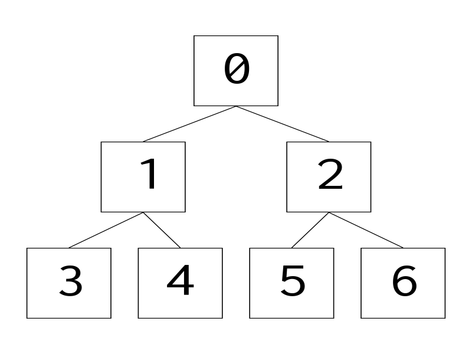

# Treedraw
Generate diagrams of trees from your text editor


## Usage
```
$ pip install treedraw
$ treedraw [input file] [output file]
```
See `treedraw --help` for more options.


## Language
`.tree` files have the following syntax:

Defining node labels:
```
label: value
```

Specifying the number of children each node has (for spacing):
```
:: children [number of children]
```

Setting the root node of the tree:
```
:: root [label]
```

Defining children of a node
```
label > label [, label ...]
```

Semicolons are optional and can be used to chain together multiple expressions.

## Examples

### Balanced tree
```
a: 0
b: 1
c: 2
d: 3
e: 4
f: 5
g: 6

:: root a

a > b, c
b > d, e
c > f, g
```



